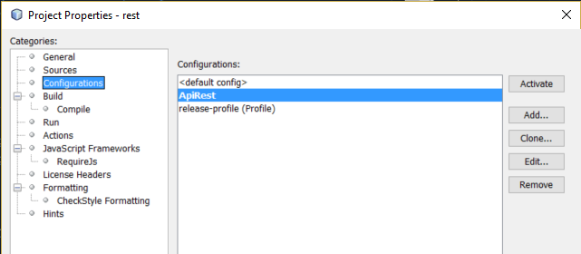
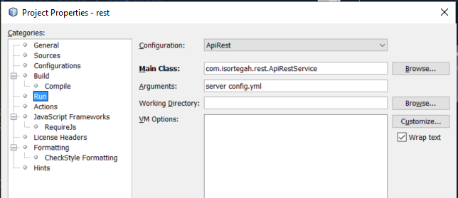

# APIREST-FULL

## Índice
* [Creación de proyecto en NetBeans](#Creación-de-proyecto-en-NetBeans)
* [Ajustes en el POM](#Ajustes-en-el-POM)
* [Creando la clase de Configuración](#Creando-la-clase-de-Configuración)
* [Crear la clase de la aplicación](#Crear-la-clase-de-la-aplicación)
* [Crear clase ejemplo](#Crear-clase-ejemplo)
* [Configuración ejecución en NetBeans](#Configuración-ejecución-en-NetBeans)
* [Proceso de dockerizacion](#Proceso-de-dockerizacion)

## Creación de proyecto en NetBeans

* El proyecto parent fue creado en NetBeans con la opción: `Maven -> POM Project`  

  

* Para los modulos se utiliza la opción: `Maven -> Java Application`


## Ajustes en el POM

* Agregar propiedad de versión de Dropwizard
```xml
    <properties>
        <dropwizard.version>INSERT VERSION HERE</dropwizard.version>
    </properties>
```
* Adicionar la libreria como dependencia.
```xml
<dependencies>
    <dependency>
        <groupId>io.dropwizard</groupId>
        <artifactId>dropwizard-core</artifactId>
        <version>${dropwizard.version}</version>
    </dependency>
</dependencies>
```

## Creando la clase de Configuración

* Crear clase `RestConfiguration.java` base:

```java
import com.fasterxml.jackson.annotation.JsonProperty;
import io.dropwizard.Configuration;
import org.hibernate.validator.constraints.NotEmpty;
import io.federecio.dropwizard.swagger.SwaggerBundleConfiguration;

/**
 *
 * @author ISORTEGAH
 */
public class RestConfiguration extends Configuration{
    @NotEmpty
    @JsonProperty
    private String baseUrl;

    public String getBaseUrl() {
        return baseUrl;
    }

    public void setBaseUrl(String baseUrl) {
        this.baseUrl = baseUrl;
    }
    
    @JsonProperty("swagger")
    public SwaggerBundleConfiguration swaggerBundleConfiguration;
}
```
> Referencia a [ejemplo](https://github.com/dropwizard/dropwizard/blob/master/dropwizard-example/src/main/java/com/example/helloworld/HelloWorldConfiguration.java) básico


* Adicionar al `pom.xml` del modulo `rest` la siguiente dependencia:

```xml
<dependency>
    <groupId>com.smoketurner</groupId>
    <artifactId>dropwizard-swagger</artifactId>
    <version>1.0.0-rc2-1</version>
</dependency>
```

* Contruir el archivo de configuración `config.yml`  
```yml
baseUrl: http://localhost
swagger:
    resourcePackage: com.corpfolder.rest.resources
server:
  applicationConnectors:
    - type: http
      port: 8080
```

## Crear la clase de la aplicación
```java
import io.dropwizard.Application;
import io.dropwizard.setup.Bootstrap;
import io.dropwizard.setup.Environment;
import io.federecio.dropwizard.swagger.SwaggerBundle;
import io.federecio.dropwizard.swagger.SwaggerBundleConfiguration;

/**
 *
 * @author ISORTEGAH
 */
public class ApiRestService extends Application<RestConfiguration>{
    
    public static void main(String[] args) throws Exception {
            new ApiRestService().run(args);
    }
    
    @Override
    public void initialize(Bootstrap<RestConfiguration> bootstrap) {
        bootstrap.addBundle(new SwaggerBundle<RestConfiguration>() {
            protected SwaggerBundleConfiguration getSwaggerBundleConfiguration(RestConfiguration configuration) {
                return configuration.swaggerBundleConfiguration;
            }           
        });
    }

    @Override
    public void run(RestConfiguration configuration,
                    Environment environment) {
    }
```
* Adicionar plugins de contrucción del jar
```xml
    <build>
	<plugins>
            <plugin>
                    <groupId>org.apache.maven.plugins</groupId>
                    <artifactId>maven-surefire-plugin</artifactId>
                    <version>2.17</version>
                    <configuration>
                            <skipTests>true</skipTests>
                    </configuration>
            </plugin>
            <plugin>
                <groupId>org.apache.maven.plugins</groupId>
                <artifactId>maven-shade-plugin</artifactId>
                <version>2.1</version>
                <executions>
                    <execution>
                        <phase>package</phase>
                        <goals>
                            <goal>shade</goal>
                        </goals>
                        <configuration>
                            <transformers>
                                <transformer implementation="org.apache.maven.plugins.shade.resource.ServicesResourceTransformer"/>
                                <transformer
                                    implementation="org.apache.maven.plugins.shade.resource.ManifestResourceTransformer">
                                    <mainClass>com.isortegah.rest.ApiRestService</mainClass>
                                </transformer>
                            </transformers>
                        </configuration>
                    </execution>
                </executions>
            </plugin>
            <plugin>
                    <groupId>org.codehaus.mojo</groupId>
                    <artifactId>exec-maven-plugin</artifactId>
                    <version>1.2.1</version>
                    <executions>
                        <execution>
                            <goals>
                                <goal>java</goal>
                            </goals>
                        </execution>
                    </executions>
                    <configuration>
                            <mainClass>com.isortegah.rest.ApiRestService</mainClass>
                            <arguments>
                                    <argument>server</argument>
                                    <argument>config.yml</argument>
                            </arguments>
                    </configuration>
            </plugin>
        </plugins>
    </build>
```

## Crear clase ejemplo 

`VersionResource.java`

```java
import com.codahale.metrics.annotation.Timed;
import com.isortegah.dtos.res.version.VersionDTO;
import io.swagger.annotations.Api;
import io.swagger.annotations.ApiOperation;
import javax.ws.rs.GET;
import javax.ws.rs.Path;
import javax.ws.rs.Produces;
import javax.ws.rs.core.MediaType;

/**
 *
 * @author ISORTEGAH
 */
@Path("/version")
@Api(value = "/version")
@Produces(MediaType.APPLICATION_JSON)
public class VersionResource {
    @GET
    @Timed
    @ApiOperation(value = "Obtiene la información de la versión", position = 0)
    public VersionDTO version() {
        
       return new VersionDTO();
       
    }
}
```

* Adicionar modulo `dtos`


* Crear la clase `VersionDTO.java`


import com.fasterxml.jackson.annotation.JsonProperty;
```java
/**
 *
 * @author ISORTEGAH
 */
public class VersionDTO {
    
    @JsonProperty
    private String nombre = "Versión 0.0.1-SNAPSHOT";

    @JsonProperty
    private String numero = "0.0.1";
    
    @JsonProperty
    private String autor = "ISORTEGAH";

    public String getAutor() {
        return autor;
    }

    public void setAutor(String autor) {
        this.autor = autor;
    }

    public String getNombre() {
            return nombre;
    }

    public void setNombre(String nombre) {
            this.nombre = nombre;
    }

    public String getNumero() {
            return numero;
    }

    public void setNumero(String numero) {
            this.numero = numero;
    }
    
}
```
* Adicionar la dependencia del modulo `dtos` al `pom.xml` del modulo `rest`

```xml
<dependency>
    <groupId>${project.groupId}</groupId>
    <artifactId>dtos</artifactId>
    <version>${project.version}</version>
    <type>jar</type>
</dependency>  
```

* Registrar el servicio en `ApiRestService.java`
```java
@Override
    public void run(RestConfiguration configuration,
                    Environment environment) {
        environment.jersey().register(new VersionResource());
    }
```

## Configuración ejecución en NetBeans

* Adicionar `Configutarion` sobre modulo `rest`  


* Registrar la configuración  


* Seleccionar la opción `Run` y dentro seleccionar la configuración adicionada con los siguientes parametros:
> Main Class: com.isortegah.rest.ApiRestService  
> Arguments: server config.yml  



## Proceso de dockerizacion

1. Crear `Dockerfile`
```bash
FROM isortegah/java8:v1


EXPOSE 8080

RUN mkdir -p /app
WORKDIR /app

ADD bootstrap.sh bootstrap.sh
ADD rest/target/rest-0.1-SNAPSHOT.jar rest.jar
ADD config.yml config.yml

ENTRYPOINT ["/bin/bash", "./bootstrap.sh"]
```
2. Crear archivo `bootstrap.sh`
```bash
#!/usr/bin/env bash
java -jar rest.jar server config.yml
```
3. Construcción de imagen
```
docker build -t qa-rest .
```

4. Ejecución de imagen

```
docker run -it -p 8080:8080 < imagen id >
```